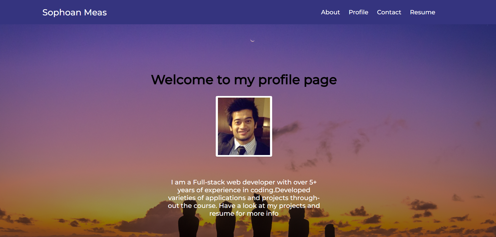
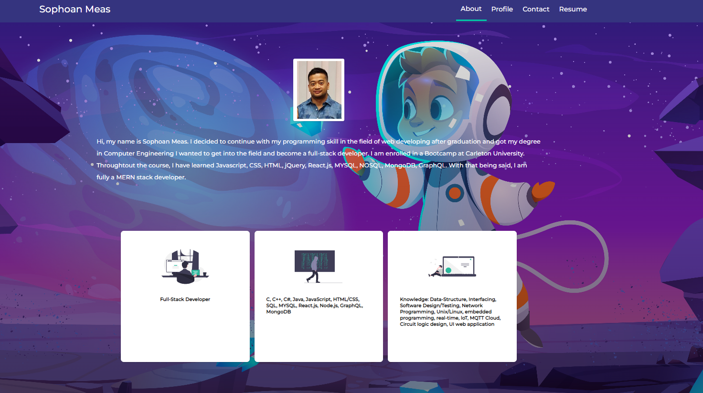
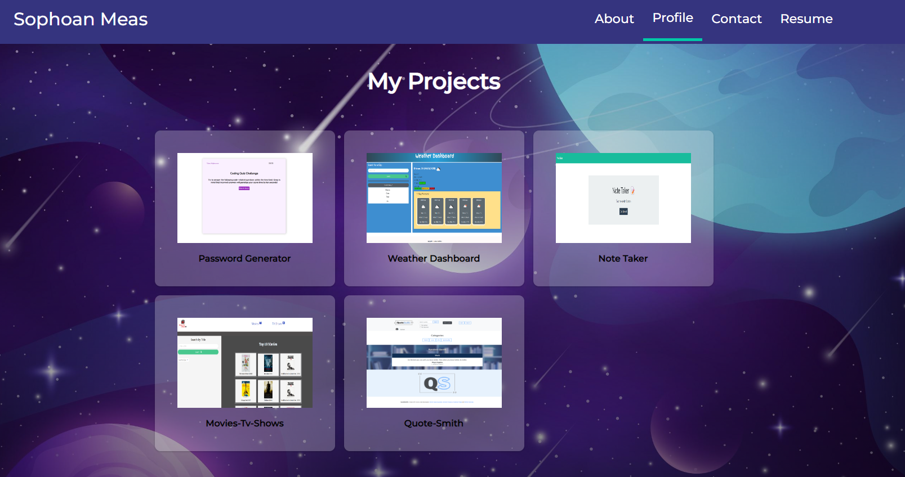

<h1 align="center">React-PortFolio 🖥️🗂️</h1>

---

# Description

This is my personal portfolio web application built with react.js. It is a single page web app implementation with the landing page, about page, profile page, contact page, and resume page.

# Table of Contents

[Installation](#installation)

[Usage](#usage)

[Technologies](#technologies)

[Contribution](#contribution)

[Tests](#test)

[Questions](#questions)

[License](#license)

# Installation

1. First have Node.js installed
2. clone the repo and in your terminal type `git clone https://github.com/SophoanMeas/react-protfolio.git`
3. type `npm i` to install all the node dependencies for this project
4. type `npm run start` to launch the application locally

# Usage
### Application 🎥

* <a href="https://sophoanmeas.github.io/react-protfolio/" target="_blank"><h4> *React Protfolio*</a>
# Technologies
Node Package Manager
* react
* react-dom
* react-router-dom
* react-scripts

Visual Appearance Package
* styled-components
* animate.css
* bootstrap
* react-icons
# Contribution

N/A

# Test

N/A
# Questions

---

<h1 align="center">Contact Me</h1>

Check out my Github for more projects

Have a question? Feel free to drop me an email.

📧[sophoan.meas@hotmail.com](mailto:sophoan.meas@hotmail.com)

---
# License

#### Copyright© [sophoanMeas](https://github.com/sophoanMeas). All rights reserved.
#### Licensed under *GNU*

---
## Screenshot

